<div align="center">

<picture>
  <source media="(prefers-color-scheme: dark)" srcset="./assets/banner-dark.svg">
  <source media="(prefers-color-scheme: light)" srcset="./assets/banner-light.svg">
  
</picture>

<br>

[](https://doi.org/10.5281/zenodo.20084689)
[](https://hashnode.com/@ParthKG)
[](https://www.linkedin.com/in/parth-krishan-goswami/)
[](mailto:parthkrishangoswami@gmail.com)

</div>

---

## The through-line

Most of what I build starts as a doubt about a number.

A brain-tumour MRI classifier of mine reported **95.39%**. I spent a summer at DRDO's Solid State Physics Laboratory finding out how much of that was real. Patient-level leakage was worth about **5.8 points** on its own. Roughly **85%** of the images in the second dataset that gets used for "external validation" turned out to be duplicates of the first. Under ImageNet-C-style corruption the same model fell to **38.5%** while staying confident — which is how a deployed model fails without anyone noticing.

That habit is the through-line, and it isn't only a research one. In a neural network I wrote from scratch it meant reading the training loop until I understood why it wanted 2,000 epochs, and then not needing them. In an LLM assistant over 3,397 government welfare schemes it meant the model answers by **calling a search tool and never from parametric memory**, so it cannot invent an eligibility rule for someone who is counting on the money.

<details>
<summary><sub><b>what the chart above is actually measuring</b></sub></summary>

<br>

One classifier, four evaluations, each more honest than the last — from [`neuroscan-ood`](https://github.com/Parth-KG/neuroscan-ood).

| Condition | Accuracy | What changed |
| :-- | --: | :-- |
| Leaky split | 96.0% | Random split — slices from one patient land on both sides |
| Grouped split | 90.2% | Split by patient, so no patient is in both sets |
| Corrupted | 66.4% | Mean over controlled, scanner-style corruptions |
| Noise | 38.5% | Worst corruption family |

3,064 slices, 233 patients. Ten seeds, paired *t*-test, *p* < 0.001. Every run seeded and reproducible.

</details>

---

## Selected work

| Project | What it is | Receipt |
| :-- | :-- | :-- |
| **[neuroscan-ood](https://github.com/Parth-KG/neuroscan-ood)** | An audit of a medical-imaging benchmark: leakage, corruption robustness, calibration, and label-free fixes. Config-driven package, unit-tested, CI on every push. | 5.8 pts of leakage · ~85% cross-dataset duplication · AdaBN + selective prediction recover most of the loss |
| **[Flood-Prediction](https://github.com/Parth-KG/Flood-Prediction)** | Five regressors on 28 years of Kanto-region flood records under time-aware validation — chronological holdout plus rolling-origin windows. | Tree ensembles beat the deep model in **every** window · published, DOI below |
| **[Sarkari-Sahayak](https://github.com/Jagrit7/Sarkari-Sahayak)** | Voice + chat assistant over 3,397 welfare schemes. Hybrid BM25 + dense retrieval fused by RRF; a phone line that works on a keypad handset with no internet. | Top 4, Agent{a}thon 2026 · smaller model on the voice path, larger on chat, stateless backend |
| **[lang-helper-bot](https://github.com/Parth-KG/lang-helper-bot)** | Multilingual correction and translation bot, live on Telegram, WhatsApp and Discord — by text or voice note. | One platform-agnostic engine; each app is a thin adapter, so a fourth platform is one file, not a rewrite |
| **[MultiClass-Digit-Classification](https://github.com/Parth-KG/MultiClass-Digit-Classification)** | A 784–64–10 network with every gradient derived and coded by hand. NumPy only, no framework. | 97.26% on MNIST · 2,000 epochs → 30 after rewriting the numerical core |
| **[MeraPaisa](https://github.com/Parth-KG/MeraPaisa)** | Native Android IOU and expense tracker, shipped solo. Multi-currency balances, lock-on-edit split redistribution, rollback to any past entry. | Kotlin · Jetpack Compose · most-starred repo here |

<sub>Also here: **[NeuroScan-AI](https://github.com/Parth-KG/NeuroScan-AI)** — the EfficientNet-B0 classifier that `neuroscan-ood` later took apart. **[explainable-vit-chest-xray](https://github.com/Parth-KG/explainable-vit-chest-xray)** — a Vision Transformer for chest radiographs, plus a quantitative test of whether its saliency maps can be trusted.</sub>

---

## Publication

**A Head-to-Head Study of Ensemble and Deep Learning Algorithms for Flood Damage Prediction in Japan**
P. K. Goswami and J. Arora · Zenodo, 2026 · [`10.5281/zenodo.20084689`](https://doi.org/10.5281/zenodo.20084689) · *under revision, ICDPN 2026*

Random Forest, XGBoost, SVR, a DNN and linear regression, benchmarked on Japanese flood-event data from 1993–2020. A Random Forest + mutual-information feature-selection pipeline surfaced population and catchment area as dominant predictors over raw rainfall. XGBoost came out ahead; the deep model never won a window.

---

## Toolbox

```
Languages     C++ · C · Python · Kotlin · Java · SQL · Bash
Systems       Linux (primary) · Git · GitHub Actions · gdb · Make · HDF5 · REST
ML            PyTorch · timm · scikit-learn · XGBoost · TensorFlow/Keras
              NumPy · Pandas · Grad-CAM · torchmetrics
Building      FastAPI · Flask · Qdrant · Streamlit · Jetpack Compose
Foundations   DSA · OOP · Operating Systems · DBMS · Networks · Theory of Computation
```

---

## Currently

- **B.Tech, Information Technology** (minor in AI/ML) at MSIT, GGSIPU — graduating Aug 2027.
- Extending the `neuroscan-ood` audit toward external validation across acquisition sources.
- Reading for graduate study in Japan. NAT-Test 5Q held, 4Q booked — basic conversational Japanese, no more than that.
- Open to work in Delhi NCR or remote: applied ML, research engineering, or C++/Python systems.

---

<div align="center">
<sub>
If you're about to quote a benchmark number, I'd look at the split first.
</sub>
<br><br>
<a href="mailto:parthkrishangoswami@gmail.com">parthkrishangoswami@gmail.com</a> · <a href="https://www.linkedin.com/in/parth-krishan-goswami/">LinkedIn</a> · <a href="https://hashnode.com/@ParthKG">Hashnode</a>
</div>
